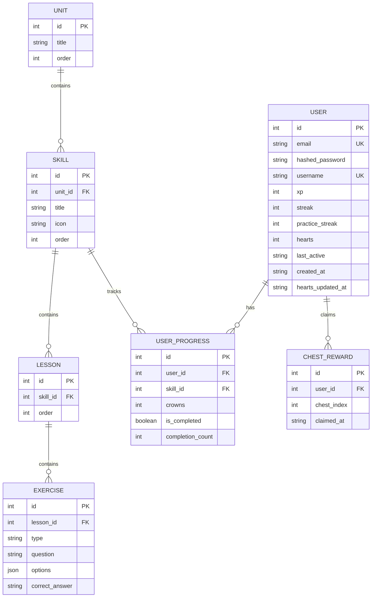

# MultiLingo

## Table of Contents

- [Overview](#overview)
- [Tech Stack](#tech-stack)
- [Setup Instructions](#setup-instructions)
- [Deployment](#deployment)
- [Architecture Overview](#architecture-overview)
- [Database Schema](#database-schema)
- [Entity Relationship Model](#entity-relationship-model)
- [API Overview](#api-overview)
- [Assumptions & Simplifications](#assumptions--simplifications)
- [Deployment Note](#deployment-note)

## Overview

MultiLingo is a Duolingo-style language learning app built around a seeded Spanish course. Learners move through an ordered skill tree, complete lessons made of multiple exercise types, and get feedback through XP, streaks, hearts, crowns, practice streaks, leaderboard position, and claimable chests. The core loop is: sign in, unlock the next skill, answer exercises, lose hearts for mistakes, complete the lesson, then return to the tree with updated progress.

## Tech Stack

| Area | Choice | Reason |
| --- | --- | --- |
| Frontend framework | Next.js 16 with React 19 | Gives the app file-based routing, a straightforward production build, and a rewrite layer that lets browser requests go through `/api` instead of calling the backend origin directly. |
| Frontend language | TypeScript | Keeps API payload shapes, context state, and component props explicit as the UI grows. |
| Styling | Tailwind CSS v4 | Fits this UI well because most screens are composed from reusable tokens and small interaction states rather than a heavy component framework. |
| Icons | lucide-react | Provides consistent iconography for skills, navigation, profile stats, and locked states. |
| Backend framework | FastAPI | Provides typed request handling, dependency injection, Pydantic validation, and a clean router structure for the API. |
| ORM | SQLAlchemy 2 async | The async session pattern matches FastAPI's request model and avoids blocking the event loop while still using explicit relational models. |
| Database | SQLite in development, Postgres in production | SQLite keeps local setup simple. Postgres is the production target and is supported through `asyncpg`. |
| Auth | JWT in `httpOnly` cookies | Cookies keep the token out of JavaScript and avoid the XSS exposure of `localStorage`, while still allowing stateless backend auth with `credentials: "include"`. |
| Password hashing | Argon2 through passlib | Passwords are stored as slow hashes, not raw passwords or reversible values. |

## Setup Instructions

Prerequisites:

- Python 3.10 or newer.
- Node.js 20 or newer.
- Postgres if you want to run against the production-style database. SQLite is the default for local development.

Clone the repository and enter the project directory:

```bash
git clone <repo-url>
cd duo
```

The backend reads environment variables directly with `os.getenv`. It does not load a `.env` file by itself, so set backend variables in your shell or rely on the local defaults. Next.js does load `frontend/.env.local`, so that is the easiest place to put the frontend API URL.

Environment variables used by the codebase:

| Variable | Used by | Required locally | Purpose |
| --- | --- | --- | --- |
| `DATABASE_URL` | Backend | No | Database connection string. Defaults to `sqlite+aiosqlite:///./multilingo.db` from the `backend` directory. `postgres://` and `postgresql://` are rewritten to `postgresql+asyncpg://` for async SQLAlchemy. |
| `JWT_SECRET` | Backend | Recommended | Secret used to sign JWT session cookies. Defaults to `dev-secret-key-change-me`, which is acceptable only for local throwaway data. |
| `FRONTEND_URL` | Backend | No | Adds a deployed frontend origin to CORS. Localhost origins are always allowed. |
| `ENV` | Backend | No | Set to `production` in production. This enables secure cross-site cookies and disables automatic dev seeding on startup. Any other value is treated as development. |
| `NEXT_PUBLIC_API_URL` | Frontend | Recommended | Backend URL used by `next.config.ts` to rewrite `/api/:path*` to the FastAPI server. Defaults to `http://localhost:8000`. |

Backend setup on Windows PowerShell:

```powershell
cd backend
py -m venv .venv
.\.venv\Scripts\Activate.ps1
pip install -r requirements.txt

$env:JWT_SECRET="local-dev-secret"
$env:ENV="development"
python reseed.py
python -m uvicorn main:app --reload --host 127.0.0.1 --port 8000
```

Backend setup on macOS or Linux:

```bash
cd backend
python3 -m venv .venv
source .venv/bin/activate
pip install -r requirements.txt

export JWT_SECRET="local-dev-secret"
export ENV="development"
python reseed.py
python -m uvicorn main:app --reload --host 127.0.0.1 --port 8000
```

`python reseed.py` creates tables and runs the same development seed path used by `main.py`: units, skills, lessons, exercises, and demo leaderboard users. In development, the API also seeds missing demo data on startup when `ENV` is not `production`.

Frontend setup:

```bash
cd frontend
npm install
```

Create `frontend/.env.local`:

```bash
NEXT_PUBLIC_API_URL=http://localhost:8000
```

Start the frontend:

```bash
npm run dev
```

The app runs at `http://localhost:3000`. The FastAPI docs are available at `http://localhost:8000/docs` when the backend server is running.

## Deployment

The deployed frontend is hosted on Vercel. The deployed backend is a FastAPI service on Render, with Postgres also provisioned on Render. This split keeps the frontend deployment simple while giving the API a managed database and a production environment that is close to the local FastAPI setup.

Vercel configuration:

- Root directory: `frontend`.
- Build command: `npm run build`.
- Install command: `npm install`.
- Environment variable: `NEXT_PUBLIC_API_URL=<render-backend-url>`.

Render backend configuration:

- Root directory: `backend`.
- Build command: `pip install -r requirements.txt`.
- Start command: `python -m uvicorn main:app --host 0.0.0.0 --port $PORT`.
- Environment variables: `DATABASE_URL`, `JWT_SECRET`, `FRONTEND_URL`, and `ENV=production`.

The Render Postgres connection string is provided to the backend as `DATABASE_URL`. The database layer accepts Render-style `postgres://` and standard `postgresql://` URLs and rewrites them to `postgresql+asyncpg://`, which is the async SQLAlchemy driver format used by the app. `FRONTEND_URL` should be set to the deployed Vercel URL so the backend allows credentialed requests from the production frontend.

Production seeding is manual. `main.py` only auto-seeds when `ENV` is not `production`, so the deployed database should be initialized intentionally by running `python reseed.py` against the Render Postgres database when the course content needs to be loaded or refreshed.


## Architecture Overview

The backend is split by API concern under `backend/routers`. Larger routers keep HTTP handling thin and move database work into controller-style functions such as `fetch_skill_tree`, `get_lesson_with_exercises`, `complete_lesson`, `check_exercise_answer`, `fetch_user_progress`, and `fetch_leaderboard`. Smaller endpoints, such as chests and practice, keep the logic inline because the route body is still short and closely tied to the response.

Database access is centralized in `backend/database.py`. `get_db` yields one `AsyncSession` per request, commits on success, and rolls back on exceptions. `expire_on_commit=False` keeps ORM objects usable after commit, which is useful in async request handlers that build responses after flushing changes. The engine also normalizes hosted Postgres URLs into the async SQLAlchemy driver format and uses SQLite with `NullPool` for local development.

On the frontend, app-wide providers are mounted in `frontend/app/layout.tsx`. `ThemeProvider` owns light and dark mode and persists the choice in `localStorage`. `AuthProvider` owns the authenticated user, calls `/auth/me` on startup, and exposes `login`, `logout`, and `updateUser` helpers to the rest of the UI. `LessonProvider` is scoped to lesson and practice screens. It owns transient lesson state such as the current exercise index, answer status, heart count, correct count, practice streak, feedback text, and mute state.

The lesson verification flow is intentionally server-centered. `GET /lessons/{lesson_id}` returns exercise prompts and options, but it does not include `correct_answer`. When a learner submits an answer, `LessonProvider` posts it to `POST /exercises/{exercise_id}/check` for normal lessons or `POST /practice/check` for practice mode. The backend loads the stored exercise, compares the normalized answer to `correct_answer`, mutates hearts or practice streak as needed, and returns the feedback payload. This keeps correct answers, heart loss, practice heart awards, and lesson failure logic out of client control.

When the final lesson exercise is finished, the client calls `POST /lessons/{lesson_id}/complete`. The backend resolves the lesson to its skill, updates or creates the `UserProgress` row, computes XP from the server-side `XP_PER_CORRECT` constant and replay rules, updates the daily streak based on `last_active`, and returns the resulting totals. The current implementation still accepts `correct_count` and `total_exercises` from the client as a pragmatic shortcut. A production hardening step would persist per-exercise attempts during the check calls and derive completion totals from those records instead.

## Database Schema

The SQLAlchemy models live in `backend/models.py`. Course content and user progress are deliberately separate. Units, skills, lessons, and exercises describe the shared course. `UserProgress` and `ChestReward` describe what one user has done inside that course. This avoids duplicating course content per user and keeps changes to the seeded course independent from each learner's state.

### Entity Relationship Model



`User` stores account and gamification state:

- `id`, primary key.
- `email`, unique and indexed.
- `hashed_password`.
- `username`, unique and indexed.
- `xp`, total XP.
- `streak`, lesson completion streak.
- `practice_streak`, consecutive correct answers in practice mode.
- `hearts`, capped at 5 by API behavior.
- `last_active`, ISO date string used for lesson streak calculation.
- `created_at`, ISO timestamp string.
- `hearts_updated_at`, ISO timestamp string used for passive heart regeneration.

`Unit` is the top-level course grouping. It has `id`, `title`, and `order`, plus a `skills` relationship ordered by the application when the tree is built.

`Skill` belongs to a unit through `unit_id`. It has `id`, `unit_id`, `title`, `icon`, and `order`, plus `unit` and `lessons` relationships. Skills are the nodes shown in the learner's path.

`Lesson` belongs to a skill through `skill_id`. It has `id`, `skill_id`, and `order`, plus `skill` and `exercises` relationships. In the seed data, each skill currently has one lesson.

`Exercise` belongs to a lesson through `lesson_id`. It has `id`, `lesson_id`, `type`, `question`, `options`, and `correct_answer`, plus a `lesson` relationship. `options` is a JSON column containing answer choices, word banks, or serialized match pairs depending on the exercise type. Public lesson responses omit `correct_answer`.

`UserProgress` connects a user to a skill. It has `id`, `user_id`, `skill_id`, `crowns`, `is_completed`, and `completion_count`. `crowns` tracks perfect completions up to five, `is_completed` unlocks downstream skills, and `completion_count` lets the lesson completion endpoint reduce or remove XP for repeated completions.

`ChestReward` records claimed tree chests. It has `id`, `user_id`, `chest_index`, and `claimed_at`. Chests are unlocked from completed skill count and are recorded separately so the same reward cannot be claimed twice.

`is_locked` is not stored in the database. It is computed in `GET /skills/tree` from ordered course content and the requesting user's `UserProgress` rows. Storing it would make lock state easy to drift out of sync when a skill is completed, reset, or reordered. Computing it at read time keeps the rule in one place: the first skill is available, and each following skill depends on the previous skill being completed.

## API Overview

All authenticated endpoints identify the user from the `access_token` httpOnly cookie. They do not accept a client-provided user id for authorization.

### Auth

- `POST /auth/signup` creates a user, normalizes email, hashes the password, and sets the session cookie. It does not trust the client to provide `id`, `xp`, `streak`, `hearts`, or a pre-hashed password.
- `POST /auth/login` verifies credentials and sets the session cookie. It does not accept client-provided JWT claims.
- `POST /auth/logout` clears the session cookie. It does not mutate learning progress.
- `GET /auth/me` returns the current authenticated user from the cookie. It does not trust a user id from the request body or query string.

### Skills and Tree

- `GET /skills/tree` returns every unit and skill merged with the current user's crowns, completion state, and computed lock state. It does not trust the client to provide unlock state, crowns, or which user's progress to read.

### Lessons and Exercises

- `GET /lessons/{lesson_id}` returns a lesson with public exercise data. It deliberately omits `correct_answer`.
- `POST /exercises/{exercise_id}/check` checks one submitted answer and decrements hearts on an incorrect answer. It does not trust the client to report correctness, heart balance, correct answer, or lesson failure.
- `POST /lessons/{lesson_id}/complete` completes the parent skill, awards XP, updates streak, and updates `UserProgress`. It does not trust the client to provide XP amount, skill id, crowns, replay count, streak, hearts, or unlock state. The current shortcut is that `correct_count` and `total_exercises` are supplied by the client instead of being derived from a persisted attempt table.

### Practice

- `GET /practice/random` returns a random public exercise. It does not expose `correct_answer`.
- `POST /practice/check` checks a practice answer, updates `practice_streak`, and awards one heart every five correct practice answers if the user is below five hearts. It does not trust the client to report correctness, practice streak, or heart awards.

### Users

- `GET /users/progress` returns XP, streak, hearts, rank, heart regeneration timing, and `last_active` for the current user. It computes passive heart regeneration and leaderboard rank server-side.
- `POST /users/reset` resets the current user's XP, streak, hearts, and skill progress. It is a development and evaluation convenience endpoint, and it does not accept a user id.

### Leaderboard

- `GET /leaderboard` returns up to 20 users with `xp > 0`, ordered by XP descending and then user id ascending. It does not trust the client to provide XP totals or ranking.

### Chests

- `GET /chests` returns the state of three chests as `locked`, `available`, or `claimed`. It computes availability from completed skill count and existing `ChestReward` rows.
- `POST /chests/{chest_index}/claim` validates the chest index, required completed skill count, and duplicate claims before awarding 30 XP. It does not trust the client to provide XP amount, completed skill count, or claim state.

## Assumptions & Simplifications

This build is scoped for a technical evaluation, so several product areas are intentionally narrow. There is no email verification or password reset flow. The course is a single seeded Spanish path rather than a course authoring system or multi-language catalog.

The leaderboard shows a simple XP ranking with a Bronze league label in the UI, not a rotating league system with promotions and demotions. Practice mode is separate from lesson completion streak logic, which keeps heart recovery practice from changing the main daily streak. The achievements section and daily quests card are present in the UI as placeholders, but they are not functionally implemented in the backend.

## Deployment Note

The deployed app depends on a Render-hosted backend. If the service has been idle, the first request can take a little while while Render wakes it up. If you are evaluating the hosted site and the first API-backed screen feels slow, please give it a moment for the backend to start.
